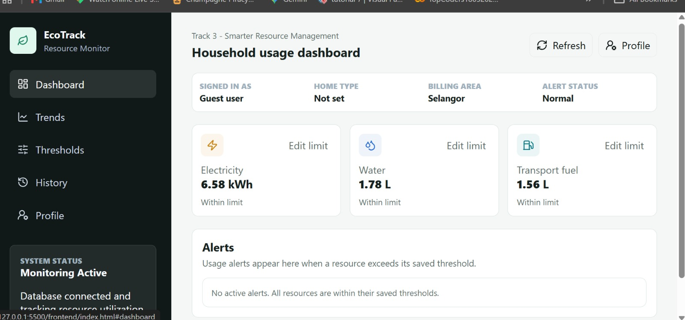
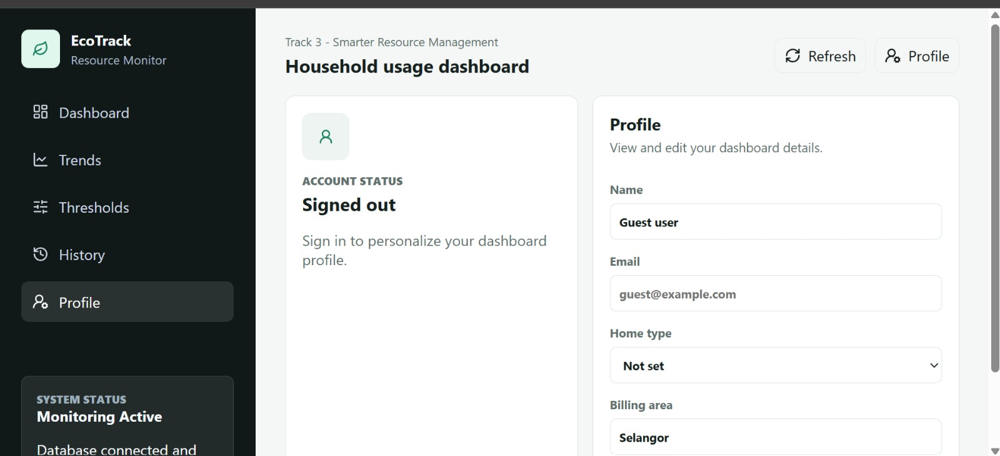

# EcoTrack Resource Dashboard

**Team LGCY4** · ImagineHack · Track 3 — DoubleDot: Smarter Resource Management

> A live dashboard that flags resource overuse before it becomes a bigger bill.

## About

Businesses and communities often waste electricity, water, and transport fuel simply
because there's no easy way to see usage in real time or know when it's running high.
EcoTrack is a lightweight dashboard that tracks these three resources, lets you set
your own usage threshold for each, and raises an alert the moment that threshold is
crossed — so overuse gets caught early instead of showing up on next month's bill.

## Resources Tracked

- ⚡ Electricity
- 💧 Water
- 🚚 Transport fuel

## Features

- **Dashboard** — live usage for all three resources at a glance, with charts showing
  current standing against each threshold.
- **Threshold Settings** — set and edit your own usage limit per resource, either
  inline from the dashboard or from a dedicated settings page.
- **Alert System** — get notified the instant a resource exceeds its threshold, with
  every past alert kept in a log.
- **Usage History** — view past usage on a daily, weekly, or monthly basis to spot
  trends before they turn into alerts.

## Screenshots

## Tech Stack

| Layer    | Technology           |
|----------|-----------------------|
| Frontend | HTML, CSS, JavaScript |
| Backend  | Python                |
| Database | SQLite                |

  ## Usage

1. Open the dashboard to view current usage for electricity, water, and transport fuel.
2. Go to **Threshold Settings** (or use the inline editor on the dashboard) to set a
   usage limit for each resource.
3. If usage exceeds a threshold, an alert is raised and logged automatically.
4. Visit **Usage History** to review daily, weekly, or monthly trends for any resource.

## Contributing

This project was built during ImagineHack and isn't currently set up for outside
contributions. If that changes, contribution guidelines (branching, code style, pull
request process) will be added here.

## License

No license has been chosen yet. Until one is added, all rights are reserved by the
project authors. *(Consider adding an [MIT](https://choosealicense.com/licenses/mit/)
or similar open-source license here if you'd like others to use or build on this
project.)*

## Team

**LGCY4**

---

*Submitted for Track 3: DoubleDot — Smarter Resource Management, ImagineHack 2026.*
